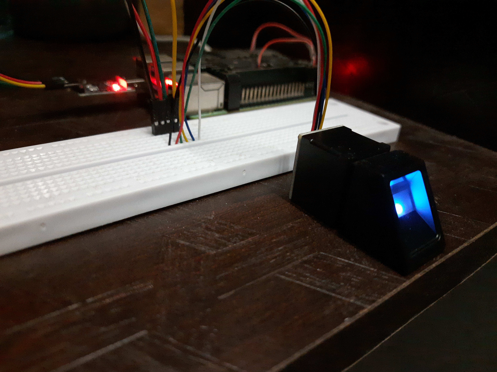
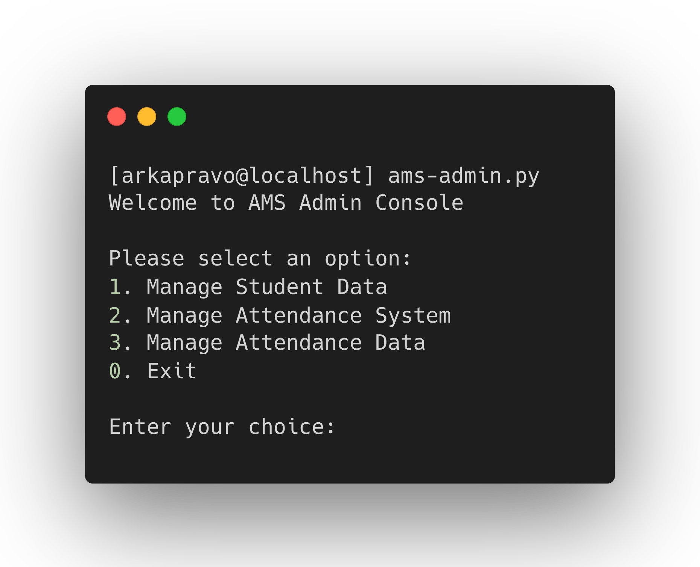
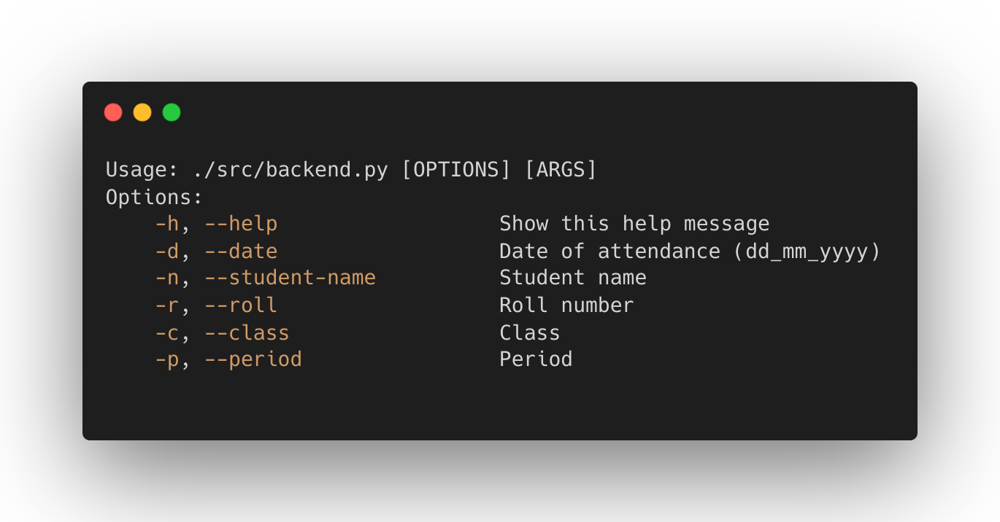
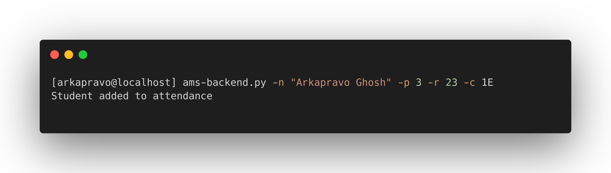

# Attendance Monitoring System using Biometrics (Fingerprint)
## Installation

*Installation guide is written at [INSTALLATION.md](docs/INSTALLATION.md).*

### Model Image:

## AMS Admin Console Usage

## Backend Usage

### Example:

