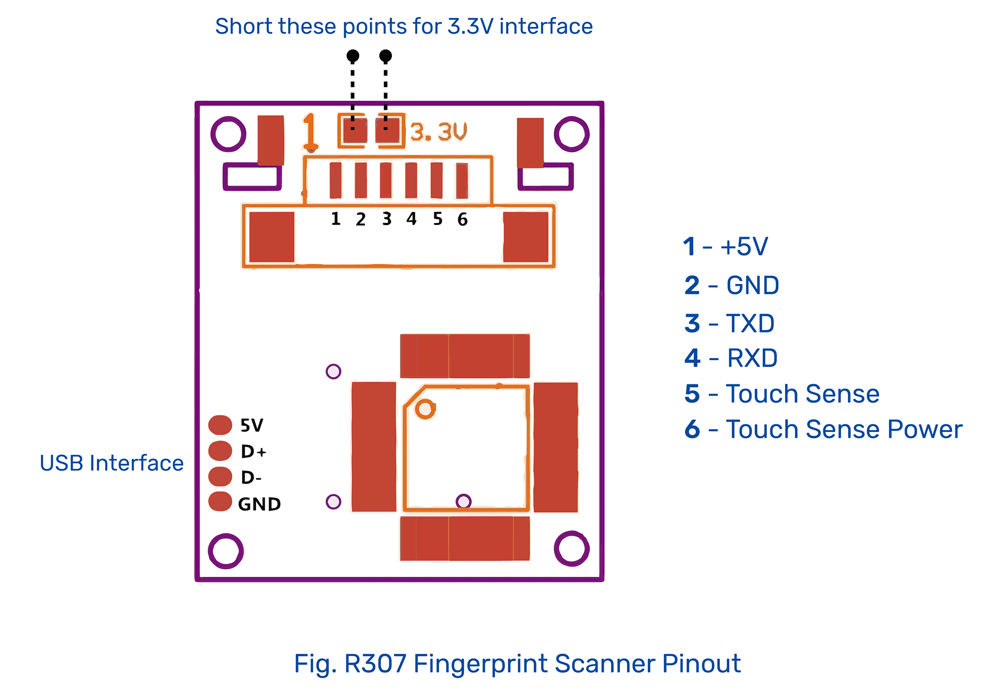
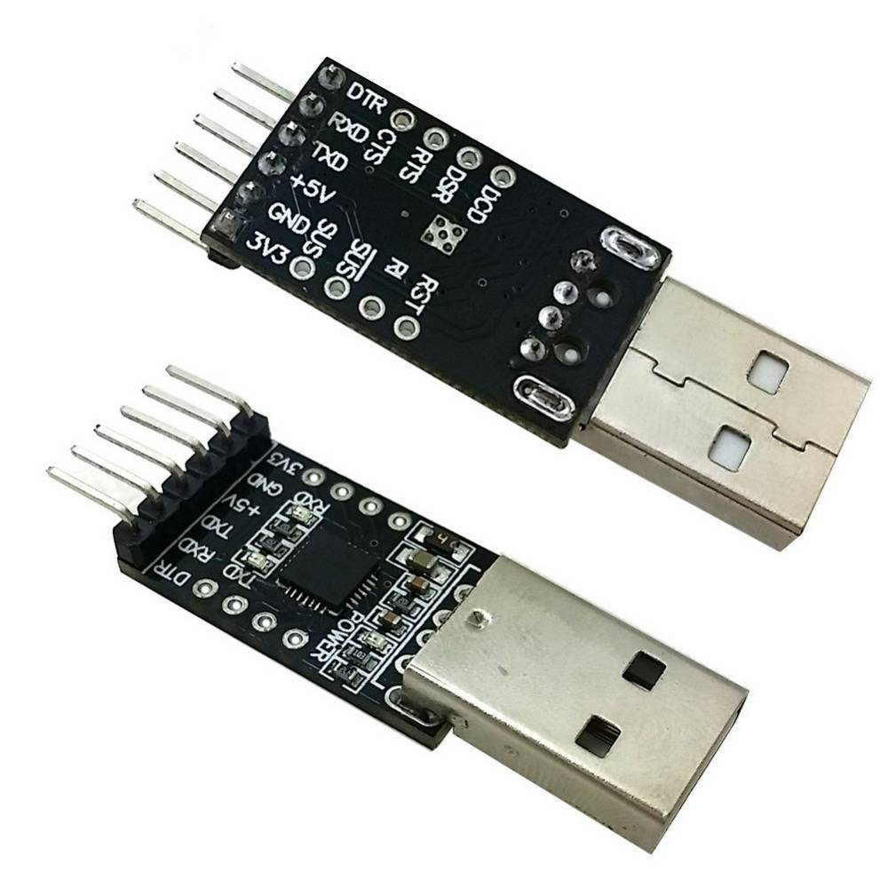

# Installation guide
## Backend
### Prerequisites:
- Any Linux distribution
- Python 3.6+
- MySQL 8.0+ or MariaDB 10.3+
- pip 19.0+
### Install project:

```bash
git clone https://github.com/Arkapravo-Ghosh/attendance-monitoring-system.git
cd attendance-monitoring-system
sudo ./install.sh
```
</details>

### Run the AMS Admin Console:

```bash
ams-admin.py
```

### Connect R307 Fingerprint Scanner to Raspberry Pi using UART to USB Converter:

<div align=center>
&nbsp;

</div>
<br>

- Connect the 5V pin of the Fingerprint Scanner to 5V pin of the UART to USB Converter and the GND pin of the Fingerprint Scanner to GND pin of the UART to USB Converter.
- Connect the TXD pin of the Fingerprint Scanner to RXD pin of the UART to USB Converter and the RXD pin of the Fingerprint Scanner to TXD pin of the UART to USB Converter.
